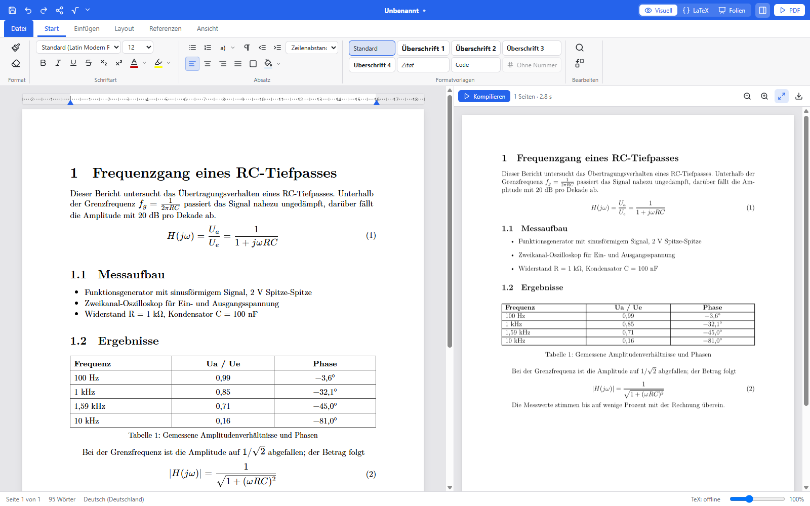
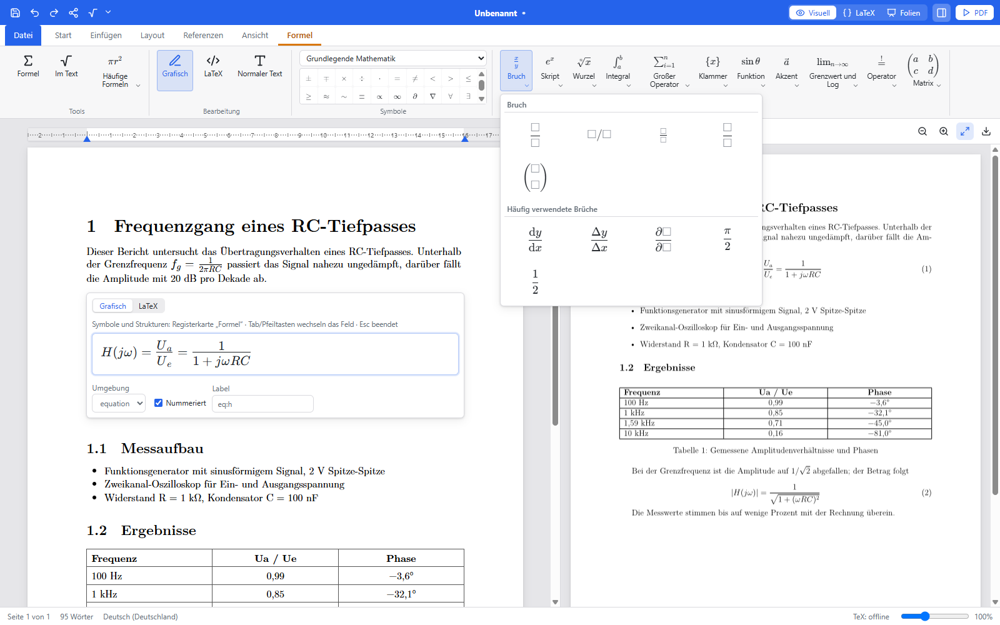
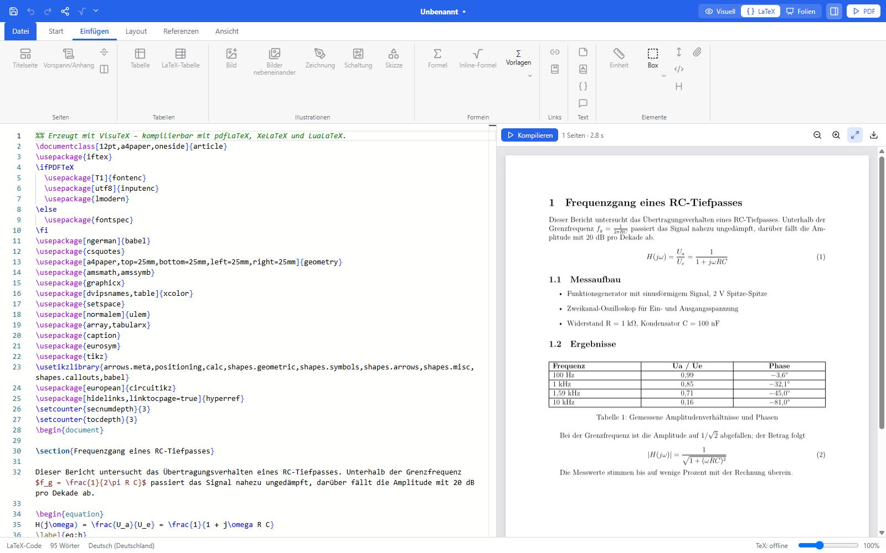
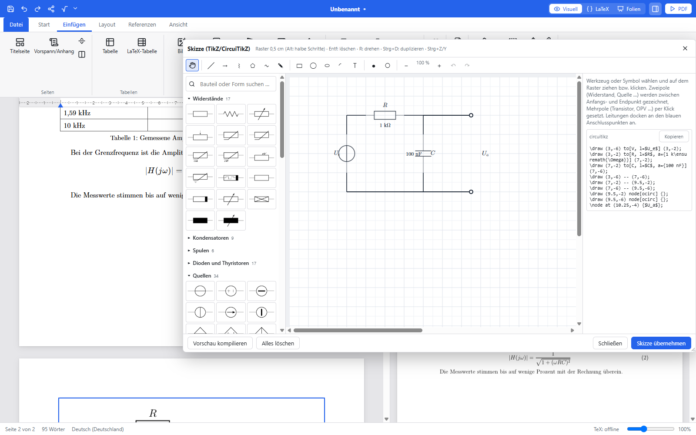
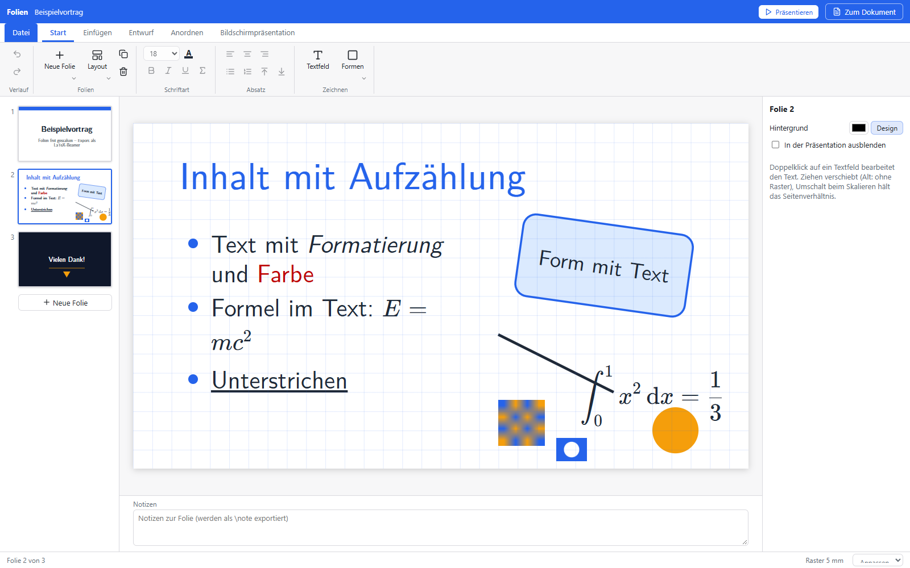
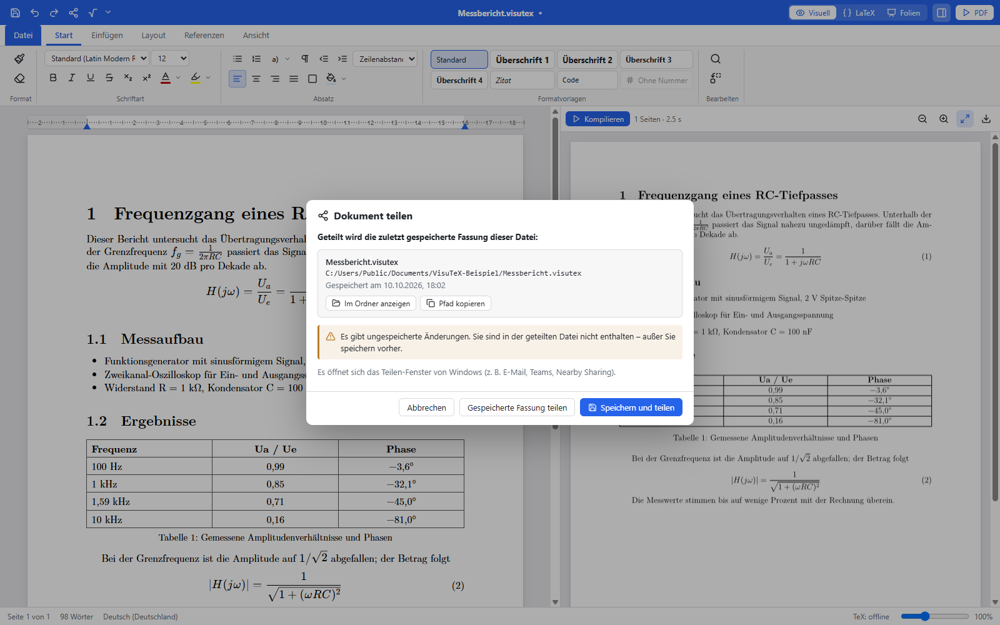
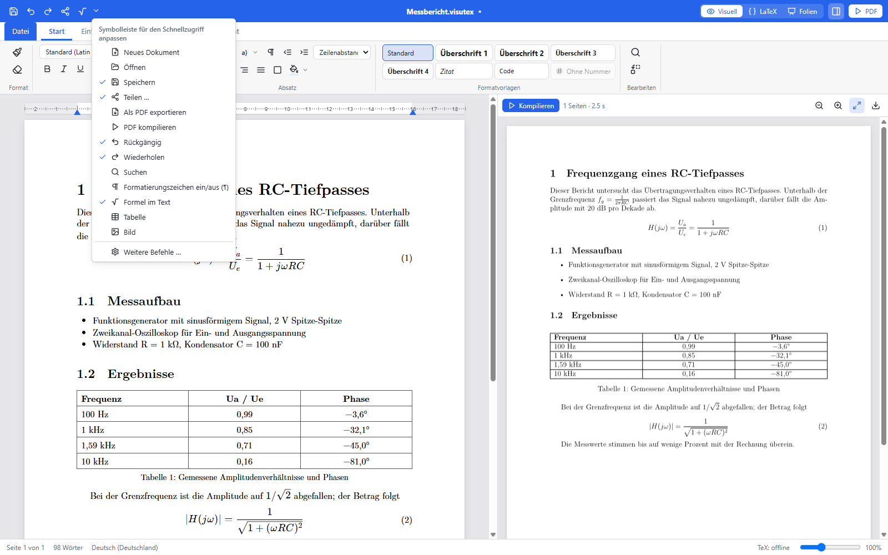
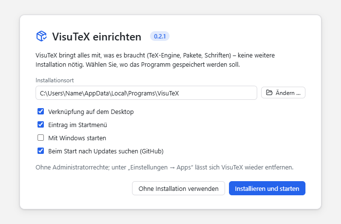

<p align="center"></p>

<h1 align="center">VisuTeX</h1>

<p align="center"><b>LaTeX schreiben wie in einer Textverarbeitung – mit eingebauter TeX-Engine.</b><br>
Visuell oder als Code, verlustfrei hin und her. Keine LaTeX-Installation nötig.</p>

<p align="center">
<a href="https://github.com/Lama072004/VisuTEX/releases"></a>
<a href="https://github.com/Lama072004/VisuTEX/actions/workflows/build.yml"></a>
<a href="LICENSE"></a>

</p>

<p align="center"><a href="#english">English version below</a> · <a href="docs/BEDIENUNG.md">Bedienung</a> ·
<a href="docs/ARCHITEKTUR.md">Architektur</a> · <a href="docs/ENTWICKLUNG.md">Entwicklung</a></p>

<p align="center"></p>

---

## Deutsch

### Worum geht es?

LaTeX liefert die schönsten Dokumente – aber der Einstieg ist mühsam: Distribution installieren, Pakete suchen,
Befehle lernen, Fehlermeldungen entziffern. **VisuTeX** nimmt diese Hürden weg. Sie schreiben wie in Word: Überschriften,
Listen, Tabellen, Bilder und Formeln über das Menüband, mit einer Seitenansicht, die dem fertigen PDF entspricht.
Im Hintergrund entsteht dabei **sauberer, portabler LaTeX-Code**, den Sie jederzeit ansehen, bearbeiten und an
Overleaf, TeX Live oder MiKTeX weitergeben können. Die TeX-Engine und alle Pakete sind eingebaut – VisuTeX funktioniert
nach dem Herunterladen sofort und auch ganz ohne Internet.

> ⚠️ **Alpha-Version:** VisuTeX ist in einer frühen Testphase. Bitte wichtige Dokumente zusätzlich sichern und Fehler unter
> [Issues](https://github.com/Lama072004/VisuTEX/issues) melden.

### Funktionen im Überblick

#### Schreiben wie in einer Textverarbeitung
- Menüband mit Start, Einfügen, Layout, Referenzen und Ansicht; Formatvorlagen, Lineal, Seitenansicht mit Kopf- und
  Fußzeilen, Formatierungszeichen (¶) wie in Word.
- Tabellen (auch über mehrere Seiten), Bilder und Bilder nebeneinander, Querverweise, Fußnoten, Abkürzungsverzeichnis,
  Größen mit Einheiten (siunitx), Inhalts-, Abbildungs- und Tabellenverzeichnis, Titelseite, Vorlagen für Abschlussarbeiten.
- Eingebaute TeX-Engine (Tectonic/XeTeX): **F5** erzeugt das PDF in wenigen Sekunden – Fehler erscheinen mit Zeilennummer.
- Kommentare stehen wie in Word als Sprechblasen neben der Seite.

#### Formeln grafisch bearbeiten
<p align="center"></p>

- Formeln wie in Word/OneNote **direkt in der gerenderten Darstellung** eingeben: `/` erzeugt einen Bruch, `^` und `_`
  hoch- und tiefgestellte Zeichen, Tab bzw. Pfeiltasten springen zwischen den Feldern.
- Registerkarte **Formel** mit Galerien für Brüche, Hoch-/Tiefstellung, Wurzeln, Integrale, Summen und Produkte,
  Klammern, Funktionen, Akzente, Grenzwerte, Operatoren und Matrizen, rund 280 Symbolen (griechische Buchstaben,
  Relationen, Pfeile, Mengen und Logik …) sowie **häufigen Formeln** zum Anpassen.
- Jederzeit auf den LaTeX-Code der Formel umschaltbar; mehrzeilige Formeln (`align` …) öffnen direkt als Code mit
  Live-Vorschau.

#### Verlustfrei zwischen Visuell und LaTeX wechseln
<p align="center"></p>

- Die Code-Ansicht zeigt das **vollständige Dokument** – kompilierbar mit pdfLaTeX, XeLaTeX und LuaLaTeX.
- Unveränderte Teile bleiben zeichengenau erhalten; Änderungen im Code erscheinen beim Zurückschalten visuell.
- **Vorhandene LaTeX-Projekte öffnen** und weiterbearbeiten – auch mit `\input`/`\include`, eigener Präambel und Bildern in
  Unterordnern. Befehle ohne sichtbare Ausgabe (`\setcounter` …) stehen dezent am linken Rand.

#### Skizzen und Schaltpläne
<p align="center"></p>

- Zeichenwerkzeug für **TikZ und CircuiTikZ** mit über 300 Bauteilen und Formen, Anschlüssen, an denen Leitungen andocken,
  Beschriftungen, Werten, Spannungs- und Strompfeilen. Der erzeugte Code erscheint daneben und bleibt bearbeitbar.

#### Präsentationen
<p align="center"></p>

- Folien frei gestalten: Textfelder, Formen, Bilder und Formeln auf einem Raster mit Hilfslinien, Designs, Notizen und
  Bildschirmpräsentation. Export als **PDF** oder als **LaTeX-Beamer-Dokument**.

#### Literatur, Teilen und mehr
<p align="center"></p>

- **Literatur** über BibTeX/natbib mit **Zotero-Anbindung**; Zitierstile u. a. IEEE und **IEEE (deutsch)**
  („und“, „Hrsg.“, „S.“ …).
- **Teilen** per Rechtsklick auf die Titelleiste: VisuTeX sagt ausdrücklich, welche gespeicherte Fassung geteilt wird,
  und öffnet das Teilen-Fenster von Windows (Linux: E-Mail mit Anhang).
- **Schnellzugriff** in der Titelleiste frei anpassbar, **Tastenkürzel** frei belegbar, Suchen und Ersetzen, Format
  übertragen, Wiederherstellung nach einem Absturz.
- Oberfläche auf **Deutsch, Englisch, Französisch, Spanisch, Italienisch, Portugiesisch, Niederländisch und Polnisch**;
  24 Dokumentsprachen mit Silbentrennung, Anführungszeichen und Zahlenformat.
- **Add-ons** (deklarativ): eigene Präambel, TeX-Dateien, Bausteine im Menüband und Vorlagen.

<p align="center"></p>

### Installation

Die aktuellen Dateien stehen unter [**Releases**](https://github.com/Lama072004/VisuTEX/releases):

| System | Datei | Hinweis |
|---|---|---|
| **Windows 10/11 (empfohlen)** | `VisuTeX_…_windows_x64.exe` | eine Datei – Einrichtung und Updates eingebaut |
| Windows | `VisuTeX_…_x64-setup.exe` / `.msi` | klassisches Installationsprogramm |
| Windows ohne Installation | `VisuTeX_…_x64-portable.zip` | z. B. für einen USB-Stick |
| Ubuntu, Debian, Linux Mint | `VisuTeX_…_amd64.deb` | `sudo apt install ./VisuTeX_…_amd64.deb` |
| Fedora, openSUSE | `VisuTeX-…-1.x86_64.rpm` | `sudo dnf install ./VisuTeX-…-1.x86_64.rpm` |
| alle anderen Distributionen | `VisuTeX_…_amd64.AppImage` | `chmod +x` und starten (mit Update-Funktion) |

<p align="center"></p>

Beim ersten Start fragt VisuTeX, **wo es gespeichert werden soll**, ob Verknüpfungen auf dem Desktop und im Startmenü
entstehen, ob es mit Windows starten und ob es **automatisch nach Updates suchen** soll – ohne Administratorrechte.
Neue Versionen lädt VisuTeX auf Wunsch selbst herunter und prüft dabei die Prüfsumme. Da die Alpha nicht digital signiert
ist, warnt Windows beim ersten Start eventuell: *Weitere Informationen → Trotzdem ausführen*.

### Erste Schritte

1. *Datei → Neu* und eine Vorlage wählen (leerer Bericht, Artikel, Abschlussarbeit …).
2. Schreiben und über das Menüband formatieren; Formeln über *Einfügen → Formel*.
3. **F5** erzeugt das PDF – rechts erscheint die Vorschau.
4. *Datei → Speichern* (`.visutex`) oder *Exportieren* als LaTeX oder PDF.

Ausführlich: [Bedienungsanleitung](docs/BEDIENUNG.md).

### Systemvoraussetzungen

- **Windows 10/11** (64 Bit); WebView2 ist vorinstalliert.
- **Linux** (64 Bit) mit WebKitGTK 4.1 – getestet auf Ubuntu 22.04/24.04, Debian 12, Linux Mint 22, Fedora 40,
  openSUSE Tumbleweed und Arch Linux.
- Rund 400 MB freier Speicherplatz. Eine LaTeX-Distribution ist **nicht** nötig.

### Aus dem Quellcode bauen

```bash
npm install
npm run setup            # prüft Rust, vcpkg und Systempakete und bietet Fehlendes an
npm run tauri dev        # starten
npm run exe              # Programm bauen (eine Datei mit allem)
npm run installer        # Windows-Installationsprogramm
```

Details, Tests und Werkzeuge: [docs/ENTWICKLUNG.md](docs/ENTWICKLUNG.md) · Aufbau: [docs/ARCHITEKTUR.md](docs/ARCHITEKTUR.md) ·
Mitwirken: [CONTRIBUTING.md](CONTRIBUTING.md).

### Lizenz

Der Quellcode steht unter der [MIT-Lizenz](LICENSE). Die fertigen Programme enthalten die TeX-Engine Tectonic, deren
XeTeX-/xdvipdfmx-Teile unter der GPL-2.0-or-later stehen; Binärpakete werden daher insgesamt unter den Bedingungen der
GPL-2.0-or-later weitergegeben. Einzelheiten: [THIRD_PARTY_NOTICES.md](THIRD_PARTY_NOTICES.md).

---

## English

### What is it about?

LaTeX produces the most beautiful documents – but getting started is hard: install a distribution, find packages, learn
commands, decipher error messages. **VisuTeX** removes these hurdles. You write as in Word: headings, lists, tables,
images and equations from the ribbon, with a page view that matches the final PDF. In the background, **clean, portable
LaTeX code** is created, which you can view, edit and pass on to Overleaf, TeX Live or MiKTeX at any time. The TeX engine
and all packages are built in – VisuTeX works right after downloading, even entirely without internet.

> ⚠️ **Alpha version:** VisuTeX is in an early testing phase. Please keep backups of important documents and report bugs
> under [Issues](https://github.com/Lama072004/VisuTEX/issues).

### Features at a glance

#### Writing like in a word processor
- Ribbon with Home, Insert, Layout, References and View; styles, ruler, page view with headers and footers, formatting
  marks (¶) like in Word.
- Tables (also across multiple pages), images and side-by-side images, cross-references, footnotes, list of
  abbreviations, quantities with units (siunitx), table of contents, lists of figures and tables, title page, thesis
  templates.
- Built-in TeX engine (Tectonic/XeTeX): **F5** produces the PDF in a few seconds – errors are shown with line numbers.
- Comments appear as balloons next to the page, like in Word.

#### Editing equations visually
<p align="center"></p>

- Type equations like in Word/OneNote **directly in the rendered view**: `/` creates a fraction, `^` and `_` superscripts
  and subscripts, Tab or the arrow keys move between fields.
- **Equation** tab with galleries for fractions, scripts, radicals, integrals, sums and products, brackets, functions,
  accents, limits, operators and matrices, about 280 symbols (Greek letters, relations, arrows, sets and logic …) and
  **common equations** to adapt.
- Switch to the LaTeX code of the equation at any time; multi-line equations (`align` …) open directly as code with a
  live preview.

#### Switching losslessly between visual and LaTeX
<p align="center"></p>

- The code view shows the **complete document** – compilable with pdfLaTeX, XeLaTeX and LuaLaTeX.
- Unchanged parts are kept character by character; changes in the code appear visually when switching back.
- **Open existing LaTeX projects** and keep working on them – including `\input`/`\include`, custom preambles and images
  in subfolders. Commands without visible output (`\setcounter` …) sit discreetly in the left margin.

#### Sketches and circuit diagrams
<p align="center"></p>

- Drawing tool for **TikZ and CircuiTikZ** with more than 300 components and shapes, pins where wires snap on, labels,
  values, voltage and current arrows. The generated code is shown alongside and stays editable.

#### Presentations
<p align="center"></p>

- Design slides freely: text boxes, shapes, images and equations on a grid with smart guides, themes, notes and a
  presentation mode. Export as **PDF** or as a **LaTeX Beamer document**.

#### References, sharing and more
<p align="center"></p>

- **References** via BibTeX/natbib with **Zotero integration**; citation styles including IEEE and **IEEE (German)**
  (“und”, “Hrsg.”, “S.” …).
- **Sharing** via right-click on the title bar: VisuTeX states explicitly which saved version is shared and opens the
  Windows share window (Linux: email with attachment).
- Fully customisable **Quick Access Toolbar** in the title bar, freely assignable **keyboard shortcuts**, find and
  replace, format painter, recovery after a crash.
- User interface in **German, English, French, Spanish, Italian, Portuguese, Dutch and Polish**; 24 document languages
  with hyphenation, quotation marks and number format.
- **Add-ons** (declarative): custom preamble, TeX files, ribbon snippets and templates.

<p align="center"></p>

### Installation

The current files are available under [**Releases**](https://github.com/Lama072004/VisuTEX/releases):

| System | File | Note |
|---|---|---|
| **Windows 10/11 (recommended)** | `VisuTeX_…_windows_x64.exe` | a single file – setup and updates built in |
| Windows | `VisuTeX_…_x64-setup.exe` / `.msi` | classic installer |
| Windows without installation | `VisuTeX_…_x64-portable.zip` | e.g. for a USB stick |
| Ubuntu, Debian, Linux Mint | `VisuTeX_…_amd64.deb` | `sudo apt install ./VisuTeX_…_amd64.deb` |
| Fedora, openSUSE | `VisuTeX-…-1.x86_64.rpm` | `sudo dnf install ./VisuTeX-…-1.x86_64.rpm` |
| all other distributions | `VisuTeX_…_amd64.AppImage` | `chmod +x` and run (with update function) |

<p align="center"></p>

On first start, VisuTeX asks **where it should be stored**, whether shortcuts should be created on the desktop and in the
Start menu, whether it should start with Windows and whether it should **check for updates automatically** – without
administrator rights. On request, VisuTeX downloads new versions itself and verifies their checksum. As the alpha is not
digitally signed, Windows may show a warning on first start: *More info → Run anyway*.

### Getting started

1. *File → New* and choose a template (blank report, article, thesis …).
2. Write and format using the ribbon; equations via *Insert → Equation*.
3. **F5** produces the PDF – the preview appears on the right.
4. *File → Save* (`.visutex`) or *Export* as LaTeX or PDF.

In detail: [user guide (German)](docs/BEDIENUNG.md).

### System requirements

- **Windows 10/11** (64-bit); WebView2 is preinstalled.
- **Linux** (64-bit) with WebKitGTK 4.1 – tested on Ubuntu 22.04/24.04, Debian 12, Linux Mint 22, Fedora 40,
  openSUSE Tumbleweed and Arch Linux.
- About 400 MB of free disk space. A LaTeX distribution is **not** required.

### Building from source

```bash
npm install
npm run setup            # checks Rust, vcpkg and system packages and offers what is missing
npm run tauri dev        # start
npm run exe              # build the program (a single file with everything)
npm run installer        # Windows installer
```

Details, tests and tools: [docs/ENTWICKLUNG.md](docs/ENTWICKLUNG.md) · structure: [docs/ARCHITEKTUR.md](docs/ARCHITEKTUR.md) ·
contributing: [CONTRIBUTING.md](CONTRIBUTING.md).

### License

The source code is licensed under the [MIT License](LICENSE). The binaries include the Tectonic TeX engine, whose
XeTeX/xdvipdfmx parts are licensed under GPL-2.0-or-later; the binary packages are therefore distributed as a whole under
the terms of GPL-2.0-or-later. Details: [THIRD_PARTY_NOTICES.md](THIRD_PARTY_NOTICES.md).
